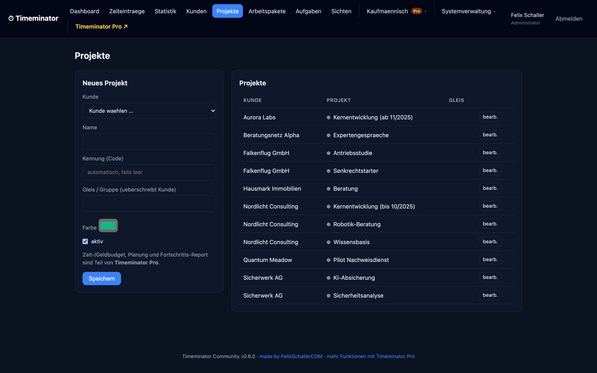

# Timeminator Community

> **Status: pre-1.0 (alpha / beta).** Current version: see the [`VERSION`](VERSION)
> file. Data model, config keys, permission codes and routes may still change
> between minor versions; a `1.0.0` will mark the first stable release. Pin an
> exact version in production and read the [`CHANGELOG`](CHANGELOG.md) before
> updating. Not fit for critical or regulated use yet.

Self-hosted, project-based time tracking with a live timer, an auditable
booking model (client, project, task, time entry) and built-in statistics and
charts. Timeminator runs on ordinary PHP shared hosting (Apache + MySQL /
MariaDB) and can also run locally with zero infrastructure using SQLite.

It was built to replace weak time-tracker plugins with something defensible:
every booking keeps its origin, the schema is prepared for auditable imports
with per-batch rollback (see `import_batches` in `schema/*.sql`), and the same
clean data set feeds several views (per project or client, a time series by
day / week / month, a generic two-group comparison, and a configurable "proof"
view with an optional cutover date). A CSV import UI is not yet part of this
edition — see [#16](https://github.com/freshNfunky/Timeminator-Community/issues/16).

- Login required, role-based permissions (admin, user, and any role you add).
- Live start / stop timer plus manual bookings.
- Statistics: hours per project and client, time series, two-group comparison,
  and a saved, fully generic "proof" view (no project is hardwired).
- Web installer, so anyone can set it up without touching the command line.
- Update check against GitHub Releases, with a guided in-app update.
- MySQL / MariaDB for hosting, SQLite for local use, one code base.

This is the **Community Edition**: it is free, open source (MIT) and fully
usable on its own for time tracking, clients/projects/tasks and statistics.
**[Timeminator Pro](https://timeminator.felixschaller.com)** adds Soll/Budget
planning with a live progress report, an offer/quote calculator with reusable
building blocks and Typst output, invoicing with accounting connectors
(lexoffice and more), and unlimited custom roles. It is a separate, privately
licensed codebase built on the same data model, so you are never locked in.

Issues and pull requests on this Community Edition are welcome.

## Screenshots

A quick tour of the app (anonymized demo data).

**Dashboard** — live timer, today / week / month totals and your latest bookings


**Statistics** — hours per project, weekly trend and a two-group comparison


**Time entries** — a filterable list with durations and running totals


**Projects** — per-client projects with codes and colors


**Tasks** — typed activities per project and work package


**Audit views** — generic, rule-based filtering of entries (optional cutover date)


## Requirements

- PHP 8.1 or newer with PDO.
- One database driver enabled in PHP:
  - `pdo_mysql` for MySQL / MariaDB (recommended for hosting), or
  - `pdo_sqlite` for the local, zero-setup mode.
- Apache with `.htaccess` support (the shipped rules protect the config and the
  data directory). Nginx works too, see "Nginx" below.
- Write access to the `data/` directory (for SQLite and update downloads) and
  to the application directory during setup (so the installer can write
  `config.php`).

No Composer, no build step, no external PHP dependencies.

## Download

Pick one.

**A. Release archive (recommended for non-developers)**

1. Go to the Releases page:
   `https://github.com/freshNfunky/Timeminator-Community/releases`
2. Download the latest `timeminator-community-x.y.z.zip`.
3. Unzip it into a folder on your web space, for example `timeminator/` inside
   your document root.

**B. Git clone (for developers)**

```
git clone https://github.com/freshNfunky/Timeminator-Community.git
cd Timeminator-Community
```

## Installation (web installer)

The installer is a guided web wizard. You do not need shell access.

1. Upload / place the files so the folder is reachable in the browser, for
   example `https://public.felixschaller.com/timeminator/`.
2. Open that URL. If no configuration exists yet, you are redirected to the
   installer at `.../timeminator/install.php`.
3. Step through the wizard:
   - **Requirements check.** The installer verifies your PHP version, the PDO
     drivers, and whether it can write `config.php` and the `data/` directory.
     Anything missing is shown with a hint before you continue.
   - **Database.** Choose MySQL / MariaDB and enter host, database name, user
     and password, or choose SQLite for a local file database. The installer
     tests the connection before proceeding.
   - **Schema.** The correct schema (`schema/mysql.sql` or `schema/sqlite.sql`)
     is applied, and the default roles and permissions are seeded.
   - **Admin account.** You create the first administrator (username, display
     name, password). The password is stored only as a bcrypt hash.
   - **Updates and registration (optional).** You can opt in to update
     notifications. Registration is opt-in and off by default, see "Privacy".
4. The installer writes `config.php`, then locks itself: once a configuration
   exists, `install.php` refuses to run again. For safety you may delete
   `install.php` after setup.

That is it. Log in at `https://public.felixschaller.com/timeminator/` with the
admin account you just created.

### Manual installation (optional)

If you prefer to set things up by hand:

1. Copy `config.sample.php` to `config.php` and edit the database section and
   `timezone`. Set `db_driver` to `mysql` or `sqlite`.
2. Create the schema:
   - MySQL: `mysql -u USER -p DBNAME < schema/mysql.sql`
   - SQLite: `sqlite3 data/timeminator.sqlite < schema/sqlite.sql`
3. Open the app in the browser. If no users exist yet, the installer will offer
   to create the first admin and seed roles and permissions.

## Run it locally (SQLite, zero infrastructure)

Great for trying it out or for offline use on a laptop.

```
cp config.sample.php config.php     # db_driver is already 'sqlite'
php -S localhost:8000
```

Open `http://localhost:8000/`, finish the short setup, and you are tracking
time. The database is a single file under `data/`.

## Run it in Docker

A `Dockerfile` and `docker-compose.yml` ship with the repo. The image is
`php:8.3-apache` with PDO (MySQL and SQLite), zip for the in-app updater and
mod_rewrite enabled — the same shape as a typical PHP shared host, so what
runs in the container also runs on your hosting plan.

```bash
# SQLite — single service, no DB server
docker compose --profile sqlite up --build

# or: MySQL — app + MariaDB in one shot
docker compose --profile mysql up --build
```

Then open `http://localhost:8080/` and click through the installer. Your
`data/` directory (SQLite file, settings, update cache) is kept on the
named volume `tm_data` and survives `docker compose down`. The MySQL
profile also persists its DB on `tm_db`. `docker compose down -v` wipes
both.

By default the installer-generated `config.php` lives inside the
container, so a `docker compose down` without `-v` keeps it, a
destructive `rm` does not. If you want it on the host so it survives
container recreation, bind-mount a host file — see the commented line in
`docker-compose.yml`.

The image does not include Composer at runtime; the project is still
"unzip and go". The in-app updater will also work inside the container.

## Updating

Timeminator can keep itself current.

- An administrator sees an "update available" notice when a newer version is
  published on the configured release channel (GitHub Releases by default).
- The in-app updater downloads the release archive, keeps your `config.php` and
  your `data/` directory untouched, replaces the application files, and runs any
  pending database migrations.
- You are always asked before anything is changed, and the current version is
  recorded so an update is reproducible.

The update check and download need outbound HTTPS from the server. If your
server has no outbound access, update manually: download the new release, copy
your `config.php` and `data/` into it, and replace the old folder.

The current version is stored in the `VERSION` file.

## Security notes

- Passwords are hashed with PHP `password_hash` (bcrypt).
- All forms are protected with CSRF tokens, all queries use prepared
  statements, and output is escaped.
- `config.php`, the `data/` directory, and the schema files are denied to the
  web by the shipped `.htaccess`. Verify this on your host: requesting
  `.../timeminator/config.php` must not return its contents.
- Serve the app over HTTPS and set `secure_cookies` to `true` in `config.php`.
- The session cookie name is configurable so it does not collide with other
  apps on the same domain.

### Nginx

There is no `.htaccess` on Nginx. Add location blocks that deny access to
`config.php`, the `data/` directory, and `*.sql` / `*.sqlite` files, and route
requests to `index.php`. A sample is in `docs/nginx.conf.sample` (if present),
otherwise adapt the rules from `.htaccess`.

## Privacy (registration, banners and lead generation)

Timeminator can, on an opt-in basis, register an installation (contact email,
site domain, and version) with the maintainer so you can be told about updates
and security notices. This is off by default, it is asked for explicitly during
setup, and it can be turned off at any time in the admin area. The endpoint it
talks to is configurable, so you can point it at your own service or disable it
entirely.

The Community edition also shows a slim **banner column** of FelixSchallerCOM
services and news, loaded server-side from a configurable subdomain with a
bundled offline fallback. With each feed refresh it sends a small anonymized
usage signal (app version, a random installation id, a hash of it, and a
truncated IP) so the operator can see roughly how many instances are live. It is
on by default in Community, every field is individually switchable, there is a
single master opt-out under **Admin → System**, and the whole feature is removed
in the Pro edition. See [`docs/BANNERS.md`](docs/BANNERS.md) for the full detail.

**No time-tracking data ever leaves your server** through either mechanism.

## Data model

The hierarchy is client, project, task, time entry. Grouping labels ("track"),
a per-project proof flag, and saved analysis views are generic attributes, so
the reporting works for any set of projects without hardcoding. Denormalized
project and client references on each entry keep history stable and make the
statistics fast. The schema reserves an `evidence` field and a `batch_id` on
each time entry so that a future CSV import can be rolled back as a whole
batch; no import UI ships in this edition yet.

## Tech

Plain PHP 8, PDO, a tiny query-string router (works without mod_rewrite),
server-rendered views, vanilla JavaScript, and a small built-in canvas chart
renderer (no external chart library, no CDN, works fully offline). No
framework, no Composer.

## License

MIT. See `LICENSE`.

## Contributing

Bug reports and pull requests are welcome on GitHub. Please keep the "no build
step, no Composer" constraint so the tool stays trivial to self-host.
