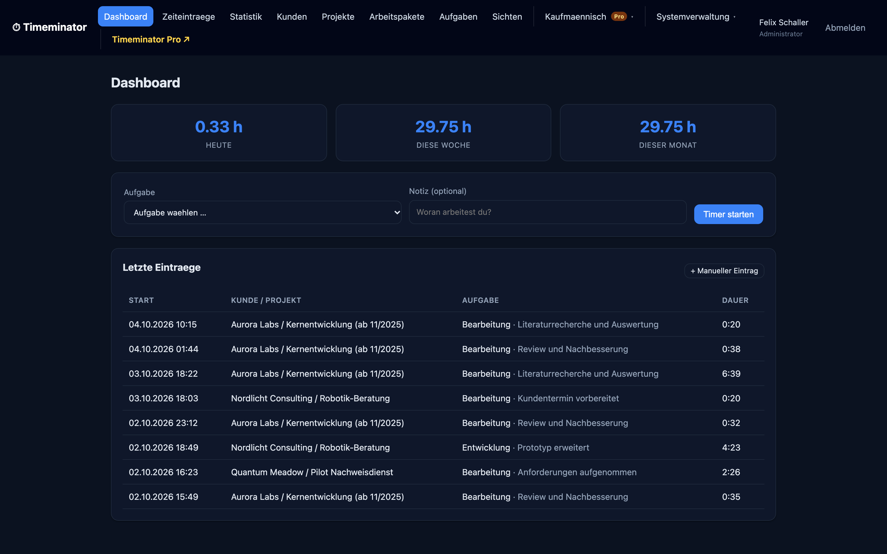
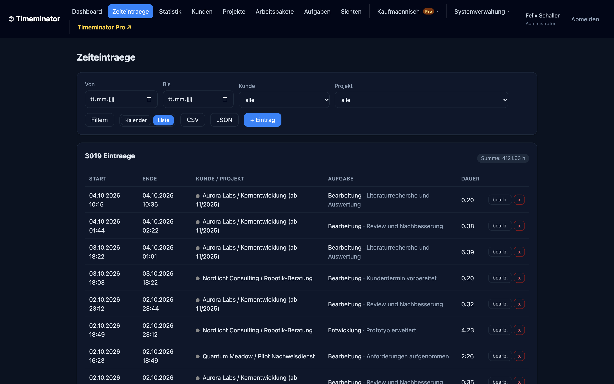
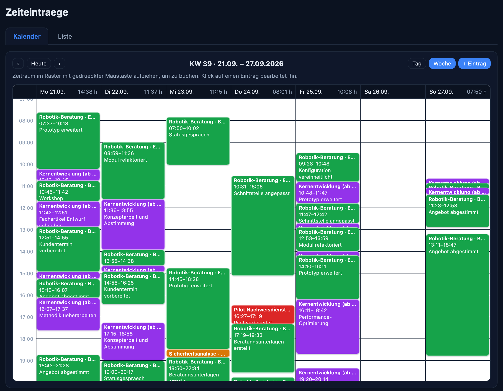
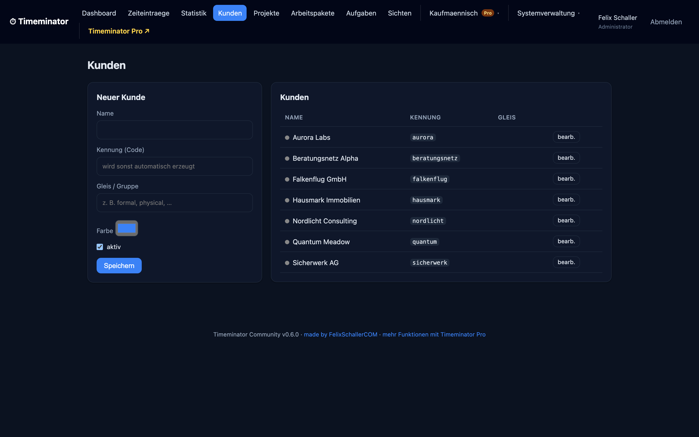
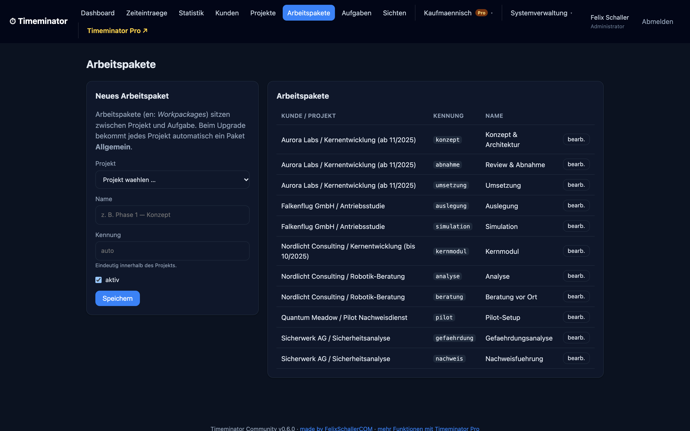
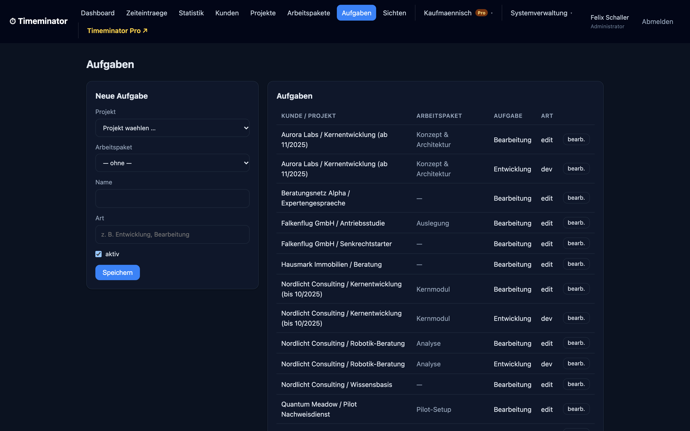
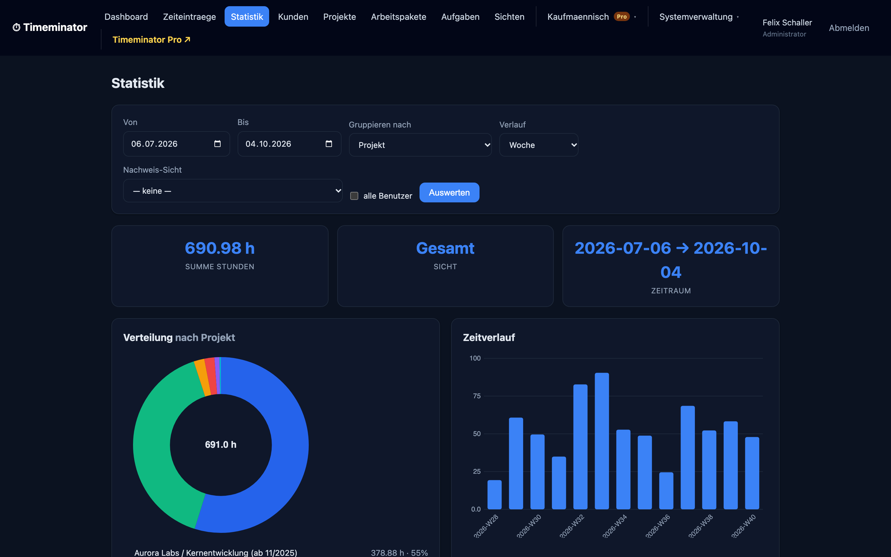
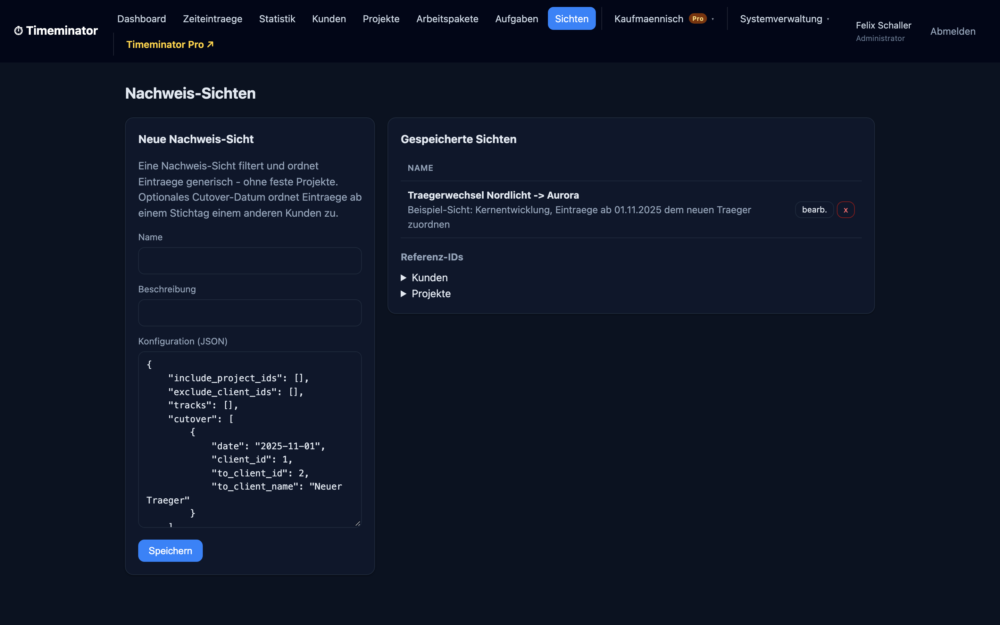

<p align="center">
  
</p>

<h1 align="center">Timeminator Community</h1>

<p align="center">
  <strong>Self-hosted, project-based time tracking with a live timer, an auditable booking model, and built-in statistics.</strong><br>
  Runs on ordinary PHP shared hosting (MySQL/MariaDB) or locally on SQLite with zero infrastructure — no Composer, no build step.
</p>

<p align="center">
  <a href="LICENSE"></a>
  
  
  
</p>

<p align="center">
  <a href="#quick-start-sqlite-30-seconds">Quick start</a> ·
  <a href="#feature-tour">Feature tour</a> ·
  <a href="#community-vs-pro">Community vs Pro</a> ·
  <a href="#installation-web-installer">Install</a> ·
  <a href="#security-notes">Security</a>
</p>

> **Status: pre-1.0 (alpha / beta).** Current version: see [`VERSION`](VERSION).
> Data model, config keys, permission codes and routes may still change between
> minor versions; `1.0.0` will mark the first stable release. Pin an exact
> version in production and read the [`CHANGELOG`](CHANGELOG.md) before updating.

---

## What is this?

Timeminator is a **self-hosted time tracker** built around a real data model, not
a glorified form. You start a **live timer** (or add a manual booking), and every
entry is tied to a clean hierarchy — **client → project → work package → task** —
so the same data set feeds a dashboard, a filterable list, a week calendar, and
built-in statistics without any of it being hardwired to one project.

It was built to be **defensible and portable**: every booking keeps its origin,
whole CSV imports can be rolled back as a batch, and nothing leaves your server.
It runs on **ordinary PHP shared hosting** (Apache + MySQL/MariaDB) and also runs
**locally on SQLite** with zero setup — one code base, no Composer, no build step,
no Docker required.

## Who is it for?

Freelancers, small agencies and teams who want their time data **on their own
box** — not in someone else's SaaS, and not trapped in a thin WordPress plugin.

<table>
  <tr>
    <td align="center" width="25%"><br><strong>Agencies</strong><br><sub>Per-client projects, hours you can defend to a client</sub></td>
    <td align="center" width="25%"><br><strong>Consultancies</strong><br><sub>Billable time, proof views, auditable bookings</sub></td>
    <td align="center" width="25%"><br><strong>R&amp;D teams</strong><br><sub>Time per work package, grant-ready evidence</sub></td>
    <td align="center" width="25%"><br><strong>Startups</strong><br><sub>Self-hosted, free, no per-seat SaaS bill</sub></td>
  </tr>
</table>

- **vs. SaaS trackers:** your time data stays on your server — no third party, no
  export lock-in, no monthly per-seat fee.
- **vs. WordPress-plugin trackers:** a real relational data model with clients,
  projects, work packages and auditable imports — not a form bolted onto a blog.

## Quick start (SQLite, 30 seconds)

Great for trying it out, or for offline use on a laptop. You need PHP 8.1+ with
`pdo_sqlite`.

```bash
git clone https://github.com/freshNfunky/Timeminator-Community.git
cd Timeminator-Community
cp config.sample.php config.php     # db_driver is already 'sqlite'
php -S localhost:8000
```

Open <http://localhost:8000/>, finish the short installer (it creates your first
admin and seeds roles), and you are tracking time. The database is a single file
under `data/`. For a production install on shared hosting, see
[Installation](#installation-web-installer) below.

## Feature tour

A quick tour of the app (anonymized demo data).

### Live timer + dashboard

Start and stop a timer against a task, or add bookings by hand. The dashboard
shows today / this week / this month at a glance, plus your latest entries.



### Time entries — list and calendar

Every booking lands in a filterable list with durations and running totals, or a
color-coded **week calendar** you can drag to book. Each entry keeps its origin,
so history stays stable.





### Clients → projects → work packages → tasks

A real hierarchy, not free-text tags. Clients hold projects, projects hold work
packages, work packages and tasks classify each entry — with codes and colors.

<p>
  
  
</p>
<p>
  
  
</p>

### Statistics, time series and proof views

Hours per project and per client, a time series by day / week / month, and a
generic two-group comparison. Save a reusable **"proof" (Nachweis) view** — a
rule-based filter with an optional cutover date — that works for any set of
projects without hardcoding.

<p>
  
  
</p>

### CSV import with per-batch rollback

Import time entries from a CSV. Every accepted upload is recorded as one
**import batch** and tags every inserted row, so a whole import can be undone as
a single batch if something was wrong.

### Team sentiment tracking

Each user records a daily mood on a five-point scale with an optional note. The
**Stimmung** page shows a 60-day personal history as a colored sparkline and a
team summary (average, response count, contributor count) over a 30-day window —
aggregated only, with no individual rows and no names.

### Roles, permissions, installer and updates

- **Login required**, with role-based permissions (admin, user, and custom roles
  you define).
- **Web installer**, so anyone can set it up without touching the command line.
- **In-app updater** that checks GitHub Releases and guides you through an update,
  keeping your `config.php` and `data/` untouched.
- **MySQL/MariaDB for hosting, SQLite for local use — one code base.**
- **Dark mode**, and a built-in canvas chart renderer (no external chart library,
  no CDN, works fully offline).

## Community vs Pro

The **Community Edition** is free, open source (MIT) and fully usable on its own.
**[Timeminator Pro](https://timeminator.felixschaller.com)** is a separate,
privately licensed codebase built on the same data model — so you are never
locked in — that adds commercial-workflow features on top.

| | Community (free, MIT) | Pro |
|---|:---:|:---:|
| Live timer + manual bookings | ✓ | ✓ |
| Clients → projects → work packages → tasks | ✓ | ✓ |
| Time entries: filterable list + week calendar | ✓ | ✓ |
| Statistics, time series, two-group comparison | ✓ | ✓ |
| Saved proof / "Nachweis" views | ✓ | ✓ |
| CSV import with per-batch rollback | ✓ | ✓ |
| Team sentiment tracking | ✓ | ✓ |
| Roles & permissions (admin, user, custom roles) | ✓ | ✓ |
| MySQL + SQLite, web installer, in-app updater | ✓ | ✓ |
| Target/budget (Soll) planning + live progress report | — | ✓ |
| Offer / quote calculator (reusable blocks, Typst output) | — | ✓ |
| Invoicing + accounting connectors (lexoffice) | — | ✓ |
| Extended role management (Rollen Pro) | — | ✓ |

See the Pro feature list and pricing at **<https://timeminator.felixschaller.com>**.

---

## Requirements

- PHP 8.1 or newer with PDO.
- One database driver enabled in PHP:
  - `pdo_mysql` for MySQL / MariaDB (recommended for hosting), or
  - `pdo_sqlite` for the local, zero-setup mode.
- Apache with `.htaccess` support (the shipped rules protect the config and the
  data directory). Nginx works too — see [Nginx](#nginx) below.
- Write access to the `data/` directory (for SQLite and update downloads) and to
  the application directory during setup (so the installer can write `config.php`).

No Composer, no build step, no external PHP dependencies.

## Download

**A. Release archive (recommended for non-developers).** Download the latest
`timeminator-community-x.y.z.zip` from the
[Releases page](https://github.com/freshNfunky/Timeminator-Community/releases) and
unzip it into a folder on your web space, e.g. `timeminator/` inside your document
root.

**B. Git clone (for developers).**

```bash
git clone https://github.com/freshNfunky/Timeminator-Community.git
cd Timeminator-Community
```

## Installation (web installer)

The installer is a guided web wizard — no shell access required.

1. Place the files so the folder is reachable in the browser, e.g.
   `https://example.com/timeminator/`.
2. Open that URL. With no configuration yet, you are redirected to the installer
   at `.../timeminator/install.php`.
3. Step through the wizard: **requirements check** → **database** (MySQL/MariaDB or
   SQLite; the connection is tested) → **schema** (the correct `schema/*.sql` is
   applied and default roles/permissions are seeded) → **admin account** (stored
   as a bcrypt hash) → **updates & registration** (opt-in, see [Privacy](#privacy)).
4. The installer writes `config.php`, then locks itself; `install.php` refuses to
   run once a configuration exists. You may delete `install.php` after setup.

### Manual installation

1. Copy `config.sample.php` to `config.php`; set `db_driver` and the database
   section and `timezone`.
2. Create the schema — MySQL: `mysql -u USER -p DBNAME < schema/mysql.sql`;
   SQLite: `sqlite3 data/timeminator.sqlite < schema/sqlite.sql`.
3. Open the app; if no users exist, the installer creates the first admin and
   seeds roles and permissions.

### Run it in Docker

A `Dockerfile` and `docker-compose.yml` ship with the repo (image: `php:8.3-apache`
with PDO for MySQL and SQLite, zip for the updater, mod_rewrite).

```bash
docker compose --profile sqlite up --build   # SQLite, no DB server
docker compose --profile mysql  up --build   # app + MariaDB
```

Then open <http://localhost:8080/> and run the installer. Your `data/` directory
persists on the named volume `tm_data`; the MySQL profile persists on `tm_db`.
`docker compose down -v` wipes both.

## Updating

- An administrator sees an "update available" notice when a newer version is
  published on the configured release channel (GitHub Releases by default).
- The in-app updater downloads the release archive, keeps your `config.php` and
  `data/` directory untouched, replaces the application files, and runs any
  pending database migrations. You are always asked before anything changes.
- No outbound access? Update manually: download the new release, copy your
  `config.php` and `data/` into it, and replace the old folder.

The current version is stored in [`VERSION`](VERSION); changes are listed in
[`CHANGELOG.md`](CHANGELOG.md).

## Security notes

- Passwords are hashed with PHP `password_hash` (bcrypt).
- All forms carry CSRF tokens, all queries use prepared statements, output is
  escaped.
- `config.php`, the `data/` directory and the schema files are denied to the web
  by the shipped `.htaccess`. Verify this on your host: requesting
  `.../timeminator/config.php` must not return its contents.
- Serve over HTTPS and set `secure_cookies` to `true` in `config.php`.
- The session cookie name is configurable so it does not collide with other apps
  on the same domain.

### Nginx

There is no `.htaccess` on Nginx. Deny access to `config.php`, the `data/`
directory and `*.sql` / `*.sqlite` files, and route requests to `index.php`. A
sample is in [`docs/nginx.conf.sample`](docs/nginx.conf.sample).

## Privacy

Timeminator can, **on an opt-in basis**, register an installation (contact email,
site domain, version) with the maintainer so you can be told about updates and
security notices. This is off by default, asked for explicitly during setup, and
can be turned off at any time. The endpoint is configurable.

The Community edition also shows a slim **banner column** of FelixSchallerCOM
services and news, loaded server-side from a configurable subdomain with a bundled
offline fallback. With each refresh it sends a small anonymized usage signal (app
version, a random installation id, a hash of it, and a truncated IP). It is on by
default in Community, every field is individually switchable, there is a single
master opt-out under **Admin → System**, and the whole feature is removed in Pro.
See [`docs/BANNERS.md`](docs/BANNERS.md) for the full detail.

**No time-tracking data ever leaves your server** through either mechanism.

## Data model

The hierarchy is client → project → work package → task → time entry. Grouping
labels ("track"), a per-project proof flag and saved analysis views are generic
attributes, so reporting works for any set of projects without hardcoding.
Denormalized project and client references on each entry keep history stable and
make statistics fast. A `batch_id` on each entry lets a whole CSV import be rolled
back as one batch.

## Tech

Plain PHP 8, PDO, a tiny query-string router (works without mod_rewrite),
server-rendered views, vanilla JavaScript, and a small built-in canvas chart
renderer (no external chart library, no CDN, works fully offline). No framework,
no Composer.

## License

MIT. See [`LICENSE`](LICENSE).

## Contributing

Bug reports and pull requests are welcome. Please keep the "no build step, no
Composer" constraint so the tool stays trivial to self-host.

---

<sub>The Timeminator mascot and product art are shared with
<a href="https://timeminator.felixschaller.com">Timeminator Pro</a>.
Made by <a href="https://felixschaller.com">FelixSchallerCOM</a>.</sub>
